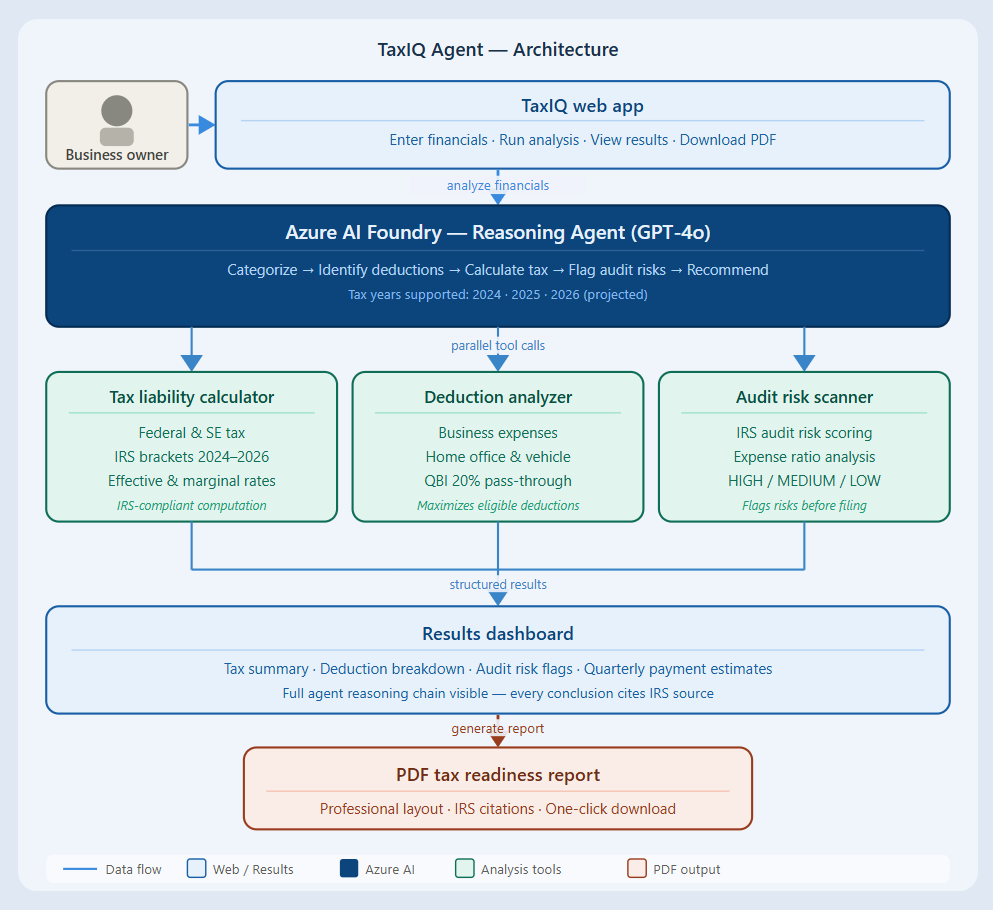

# TaxIQ Agent 🧾

> An AI-powered tax reasoning agent for small businesses and self-employed individuals — built on Azure AI Foundry for the **Microsoft Agents League @ AI Skills Fest**.

**Demo Video:** https://youtu.be/qkA2_99iqhQ

**Track:** Reasoning Agents (Azure AI Foundry)
**Tax Years Supported:** 2024 · 2025 · 2026 (projected)
**Target users:** Freelancers, sole proprietors, LLC owners, S-Corp owners

---

## What it does

TaxIQ performs a **5-step reasoning chain** to analyze a business's financial situation and produce a structured tax readiness report:

| Step | What happens |
|---|---|
| 1. Categorize | Reviews and classifies all income and expense items |
| 2. Identify Deductions | Applies IRS rules (§162, §179, §274, §280A, QBI) to find every valid deduction |
| 3. Calculate Liability | Computes federal income tax + self-employment tax using correct year's brackets |
| 4. Flag Audit Risks | Highlights items with elevated IRS audit risk and explains why |
| 5. Recommend | Provides actionable tax-saving strategies specific to the business |

The agent **shows its reasoning at every step** — citing the relevant IRS code section before calling a tool, never producing a number without justification.

---

## Why this matters (Hack for Good)

Millions of small business owners and freelancers in the US **can't afford a CPA** for year-round tax planning. TaxIQ gives them professional-grade, reasoned tax analysis instantly — reducing overpayments, surfacing deductions they'd miss, and flagging risks before they become audits.

---

## Architecture



---

## Tech Stack

| Layer | Technology |
|---|---|
| Agent orchestration | Azure AI Foundry · OpenAI Assistants API (beta) |
| Reasoning model | GPT-4o via Azure OpenAI |
| SDK | `openai` Python SDK (`AzureOpenAI`, `beta.assistants`, `beta.threads`) |
| UI | Streamlit 1.x |
| PDF generation | fpdf2 |
| Tax logic | Custom Python (IRS 2024/2025/2026 brackets, SE tax, QBI, §162/§274/§280A) |
| Config | python-dotenv |

---

## Setup

### Prerequisites
- Python 3.11+
- Azure subscription with an Azure OpenAI resource deployed (GPT-4o)

### Install

```bash
pip install -r requirements.txt
```

### Configure

Create a `.env` file:

```env
AZURE_OPENAI_ENDPOINT=https://<your-resource>.openai.azure.com/
AZURE_OPENAI_API_KEY=<your-key>
FOUNDRY_MODEL_NAME=gpt-4o
```

### Run

```bash
streamlit run app.py
```

Open `http://localhost:8501` in your browser.

---

## Project Structure

```
app.py                          # Streamlit UI — entry point
agent/
  tax_agent.py                  # Azure OpenAI Assistants loop + tool dispatch
  prompts/
    system_prompt.py            # Agent persona, step format, IRS rules
  tools/
    tax_calculator.py           # IRS logic + TOOL_DEFINITIONS schemas
    report_generator.py         # fpdf2 PDF builder
.env                            # API credentials (not committed)
```

---

## Judging Criteria Alignment

| Criterion | How TaxIQ addresses it |
|---|---|
| **Accuracy & Relevance (20%)** | Real IRS brackets for 2024/2025/2026, §162/§179/QBI rules, SE tax formula |
| **Reasoning & Multi-step (20%)** | Explicit 5-step chain with labelled steps, tool calls visible in UI |
| **Reliability & Safety (20%)** | Every conclusion cites an IRC section; disclaimer on all outputs |
| **Creativity & Originality (15%)** | Tax domain + visible reasoning chain + multi-year planning is novel |
| **User Experience (15%)** | Collapsible sidebar with collapsible input sections, collapsible 5-step analysis sections, live tool tracking, structured results, PDF download |
| **Hack for Good** | Serves freelancers/SMBs who can't afford a CPA |

---

## Disclaimer

This tool is for **informational purposes only** and does not constitute professional tax advice. Always consult a licensed CPA or tax professional for your specific situation.

---

*Built for Microsoft Agents League @ AI Skills Fest · June 2026*
